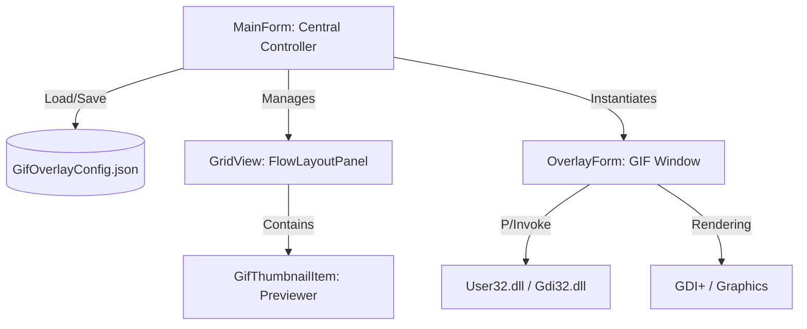

# Project Context: OwOverlays (AI-Optimized)

This document provides a structured technical overview designed for AI models and developers to rapidly understand the architecture and core logic of OwOverlays.

## 🏗 System Architecture

The application implements a **Centralized Controller** pattern using Windows Forms (WinForms).



### Key Components

| Component | Responsibility | Technical Details |
| :--- | :--- | :--- |
| **`MainForm`** | Orchestrator | Manages the lifecycle of overlays, global configuration, and the System Tray. |
| **`OverlayForm`** | View/Render | Implements `Layered Windows` for true per-pixel transparency. |
| **`GifThumbnailItem`** | Grid Item | Custom control for GIF previews within the management grid. |
| **`OverlayConfig`** | DTO | Data model for individual overlay state serialization. |
| **`AppSettings`** | DTO | Container for global application settings serialization. |

## 🛠 Core Implementation Logic

### 1. Advanced Transparency (Layered Windows)

To render GIFs with transparency over other windows without visible borders:

- **Window Attributes**: Utilizes `WS_EX_LAYERED` and `WS_EX_TRANSPARENT`.
- **UpdateLayeredWindow**: The critical `user32.dll` function used to copy an `IntPtr` (HDC) buffer with an Alpha channel directly to the desktop composition layer.

### 2. Animation Engine

Utilizes a manual `System.Windows.Forms.Timer` (calibrated for .NET 9 compatibility):

- **Rationale**: `UpdateLayeredWindow` requires a full redraw of the window on every GIF frame to maintain correct Alpha composition.
- **Resource Management**: When the display is paused via the tray menu, animation timers stop and the rendering cycle suspends, reducing CPU/GPU utilization to zero.

### 3. Management Interface (UI/UX)

- **Grid Preview**: Replaces traditional text lists with a `FlowLayoutPanel` containing `GifThumbnailItem` instances.
- **Thumbnailing**: Thumbnails extract the first frame of the GIF and render it with transparency support for an accurate preview.
- **Selection Detection**: The grid is synchronized with active overlays; selecting a thumbnail highlights the corresponding overlay on screen.

## ⚙️ Configuration and Execution (CLI)

- **Runtime**: `.NET 9.0 (Windows)`
- **Dependencies**: `Newtonsoft.Json` (v13.0.3)

### Terminal Commands

```powershell
# Compile
dotnet build

# Run
dotnet run
```

## 📦 Production Deployment

The `.csproj` file is configured for clean publishing with `PublishSingleFile=true`:

1.  **Embedded Resources**: Icons are included as embedded resources.
2.  **SingleFile Exclusion**: `app_icon.ico` and `tray_icon.ico` are copied to the output directory (`ExcludeFromSingleFile=true`) to ensure direct path access if required by the OS shell.

Recommended Publish Command:

```powershell
dotnet publish -c Release -r win-x64 --self-contained true -p:PublishSingleFile=true -o "./dist"
```

The output is generated in the `\dist` folder.

## 🎯 AI Prompting Context (Technical Gotchas)

When modifying this codebase, consider the following:

1. **P/Invoke**: Win32 API signatures are localized in `OverlayForm`.
2. **Coordinates**: The system operates using global screen coordinates (`Screen.PrimaryScreen`).
3. **.NET 9 Migration**: `GenerateAssemblyInfo` is disabled in the `.csproj` to prevent conflicts with `Properties/AssemblyInfo.cs`.

---

_Document optimized for semantic context transfer._

## 💻 Code Analysis: Form1.cs

Derived from source code inspection:

### Namespaces and Dependencies

- `OwOverlays` (Primary Namespace)
- `Newtonsoft.Json` (Configuration Management)
- `System.Drawing.Imaging` (GIF Manipulation)
- `System.Runtime.InteropServices` (Win32 APIs)

### Primary Class: `Form1`

Inherits from `Form` and serves as the main application controller.

#### Identified Properties

- `GifHeight` (int): Global height setting for GIFs (default: 100).
- `RespectTaskbar` (bool): Setting to honor the taskbar's reserved area.
- `OverlayConfig`: Data structure for individual overlay configurations.
- `OverlayOrientation`: Enum defining overlay placement/orientation.

#### Key Methods

- `SaveConfig()`: Serializes state to JSON.
- `LoadConfig()`: Loads initial state.
- `TogglePause()`: Global visibility and power-saving management.
- `RebuildGrid()`: Synchronizes the UI with the current overlay state.
- Event handlers for mouse interactions and GDI+ rendering.

