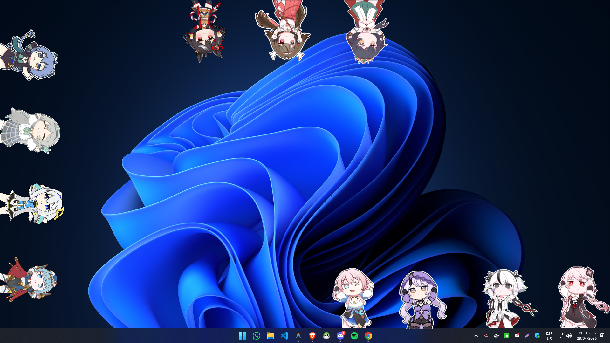

# OwOverlays

OwOverlays is a lightweight Windows application designed to overlay animated GIFs directly onto the desktop or any other window using true per-pixel transparency.



## Key Features

- **Supported Formats:** Full support for **GIF, animated WebP**, **PNG, and JPG** (static).
- **Multi-Monitor Compatibility:** Support for multiple displays including a monitor selector and persistent per-overlay configuration.
- **Automatic Rotation:** Overlays automatically rotate when dragged to screen edges (bottom, top, left, right).
- **Chroma Key (Green Screen):** Background color removal via a single click. Features an **eye-dropper** tool and a **tolerance** slider for precise edge blending.
- **True Transparency:** Seamless integration using alpha channel or chroma key composition.
- **Management Grid:** A modern visual interface for previewing and organizing active overlays.
- **Performance Optimization:** An intelligent pause system that reduces CPU consumption to zero when overlays are hidden or inactive.
- **Configuration Persistence:** Automatic saving of positions, sizes, chroma settings, monitor selection, and other preferences.
- **Drag & Drop Support:** Drop GIFs or animated WebP files directly into the application window for instant overlay.
- **Global Z-Order Management:** Toggle "Always on Top" to keep overlays floating above all windows or send them to the background (wallpaper mode).
- **JSON Presets:** Export and import your entire overlay configuration as JSON files for easy sharing or switching between setups.
- **System Tray Integration:** Discrete background execution via the system tray (blue circle icon).

## Prerequisites

- **OS:** Windows 10 or 11 (uses native Win32/GDI+ APIs).
- **Runtime:** .NET 9.0 (unless using the self-contained version).

## Quick Start

1. Download the latest release from the `dist` folder.
2. Launch `OwOverlays.exe`.
3. Right-click the system tray icon (represented by a green/red circle) to add GIFs or access the management window.

## Development

To compile the project manually:

```powershell
dotnet build
dotnet run
```

To generate a standalone executable without external dependencies:

```powershell
dotnet publish -c Release -r win-x64 --self-contained true -p:PublishSingleFile=true -o "./dist"
```

## License

This project is distributed under the MIT License.

---

## Development Philosophy: Vibecoding
This project was developed using a **Vibecoding** workflow—a modern approach to software creation where the focus is on high-level intent, creative direction, and rapid AI-assisted iteration. By pairing human architectural vision with advanced AI execution, OwOverlays achieved high technical complexity and a premium feel in record time.

