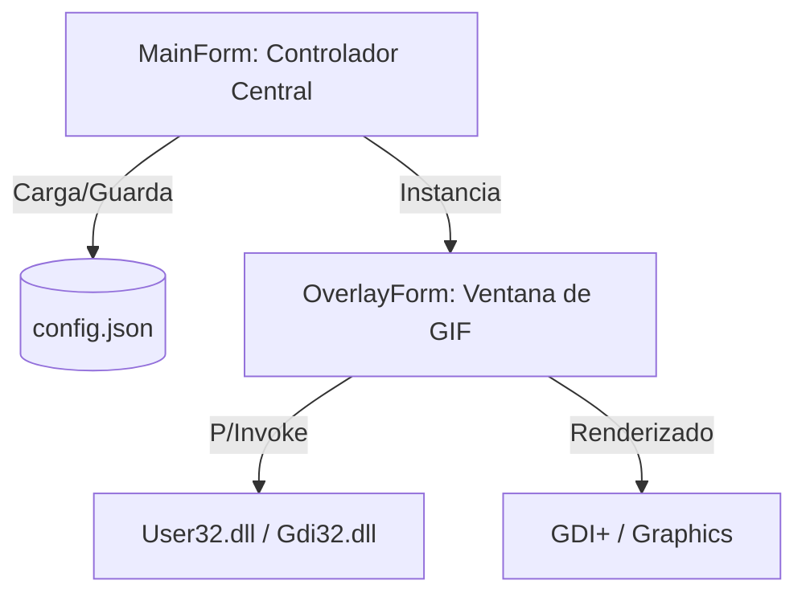

# Contexto del Proyecto: GifOverlay (AI-Optimized)

Este documento proporciona una visión técnica estructurada para que modelos de IA y desarrolladores comprendan rápidamente la arquitectura y lógica de GifOverlay.

## 🏗 Arquitectura del Sistema

La aplicación sigue un modelo de **Controlador Centralizado** mediante WinForms.



### Componentes Clave

| Componente          | Responsabilidad | Detalles Técnicos                                                                    |
| :------------------ | :-------------- | :----------------------------------------------------------------------------------- |
| **`MainForm`**      | Orquestador     | Gestiona el ciclo de vida de los overlays, la configuración global y el System Tray. |
| **`OverlayForm`**   | Vista/Render    | Implementa `Layered Windows` para transparencia real por píxel.                      |
| **`OverlayConfig`** | DTO             | Modelo de datos para serialización de estado individual.                             |
| **`AppSettings`**   | DTO             | Contenedor para serialización global.                                                |

## 🛠 Detalles de Implementación (Core Logic)

### 1. Transparencia Avanzada (Layered Windows)

Para el renderizado de GIFs con transparencia sobre otras ventanas sin bordes visibles:

- **Atributos de ventana**: Usa `WS_EX_LAYERED` y `WS_EX_TRANSPARENT`.
- **UpdateLayeredWindow**: Es la función crítica de `user32.dll` que copia un buffer `IntPtr` (HDC) con canal Alpha directamente al escritorio.

### 2. Motor de Animación

Utiliza un `System.Windows.Forms.Timer` manual (ajustado para evitar ambigüedades en .NET 9):

- **Razonamiento**: `UpdateLayeredWindow` requiere redibujar toda la ventana en cada frame del GIF para mantener la composición Alpha correctamente.

## ⚙️ Configuración y Ejecución (CLI)

- **Runtime**: `.NET 9.0 (Windows)`
- **Dependencias**: `Newtonsoft.Json` (v13.0.3)

### Comandos de Terminal

```powershell
# Compilar
dotnet build

# Ejecutar
dotnet run --project GifOverlay
```

## 📦 Empaquetado para Producción

He creado un script AUTOMATIZADO llamado `publish.bat` en la raíz del proyecto. Al ejecutarlo, tendrás dos opciones:

1.  **Ejecutable Ligero (Framework-Dependent)**: El archivo `.exe` es pequeño, pero el PC que lo reciba debe tener instalado .NET 9.
2.  **Todo en Uno (Self-Contained)**: Crea un único archivo `.exe` que contiene todo lo necesario. Es más pesado pero funciona en cualquier Windows x64 sin instalar nada.

El resultado se guardará en la carpeta `\dist`.

## 🎯 Guía para la IA (Prompting Context)

Si trabajas en este código, ten en cuenta:

1. **P/Invoke**: Las firmas de Win32 están en `OverlayForm`.
2. **Coordenadas**: El sistema usa coordenadas globales de pantalla (`Screen.PrimaryScreen`).
3. **Migración .NET 9**: Se deshabilitó `GenerateAssemblyInfo` en el `.csproj` para evitar conflictos con `Properties/AssemblyInfo.cs`.

---

_Documento optimizado para transferencia de contexto semántico._

## 💻 Análisis de Código: Form1.cs

Basado en la inspección del código fuente (recuperado parcialmente debido a codificación):

### Espacios de Nombres y Dependencias

- `OwOverlays` (Namespace principal)
- `Newtonsoft.Json` (Gestión de configuración)
- `System.Drawing.Imaging` (Manipulación de GIFs)
- `System.Runtime.InteropServices` (Win32 APIs)

### Clase Principal: `Form1`

Hereda de `Form` y actúa como el controlador principal.

#### Propiedades Identificadas

- `GifHeight` (int): Altura global para los GIFs (por defecto 100).
- `RespectTaskbar` (bool): Configuración para respetar el área de la barra de tareas.
- `OverlayConfig`: Clase/Estructura para almacenar la configuración de cada overlay.
- `OverlayOrientation`: Enum para la orientación de los overlays.

#### Métodos Clave (Inferidos)

- `SaveConfig()`: Serialización de estado a JSON.
- `LoadConfig()`: Carga de estado inicial.
- Manejo de eventos de ratón y renderizado GDI+.
