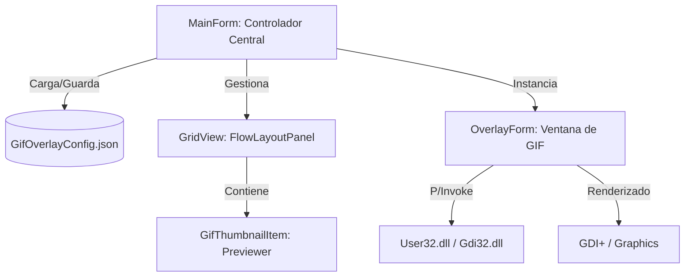

# Contexto del Proyecto: GifOverlay (AI-Optimized)

Este documento proporciona una visión técnica estructurada para que modelos de IA y desarrolladores comprendan rápidamente la arquitectura y lógica de GifOverlay.

## 🏗 Arquitectura del Sistema

La aplicación sigue un modelo de **Controlador Centralizado** mediante WinForms.



### Componentes Clave

| Componente             | Responsabilidad | Detalles Técnicos                                                                    |
| :--------------------- | :-------------- | :----------------------------------------------------------------------------------- |
| **`MainForm`**         | Orquestador     | Gestiona el ciclo de vida de los overlays, la configuración global y el System Tray. |
| **`OverlayForm`**      | Vista/Render    | Implementa `Layered Windows` para transparencia real por píxel.                      |
| **`GifThumbnailItem`** | Grid Item       | Control personalizado para previsualización de GIFs en la cuadrícula de gestión.     |
| **`OverlayConfig`**    | DTO             | Modelo de datos para serialización de estado individual.                             |
| **`AppSettings`**      | DTO             | Contenedor para serialización global.                                                |

## 🛠 Detalles de Implementación (Core Logic)

### 1. Transparencia Avanzada (Layered Windows)

Para el renderizado de GIFs con transparencia sobre otras ventanas sin bordes visibles:

- **Atributos de ventana**: Usa `WS_EX_LAYERED` y `WS_EX_TRANSPARENT`.
- **UpdateLayeredWindow**: Es la función crítica de `user32.dll` que copia un buffer `IntPtr` (HDC) con canal Alpha directamente al escritorio.

### 2. Motor de Animación

Utiliza un `System.Windows.Forms.Timer` manual (ajustado para evitar ambigüedades en .NET 9):

- **Razonamiento**: `UpdateLayeredWindow` requiere redibujar toda la ventana en cada frame del GIF para mantener la composición Alpha correctamente.
- **Gestión de Recursos**: Al pausar la visualización mediante el menú de la bandeja, los timers de animación se detienen y el ciclo de renderizado se suspende, reduciendo el uso de CPU/GPU a cero.

### 3. Interfaz de Gestión (UI/UX)

- **Grid Preview**: Reemplaza la lista de texto tradicional por un `FlowLayoutPanel` que contiene instancias de `GifThumbnailItem`.
- **Thumbnailing**: Las miniaturas extraen el primer frame del GIF y lo renderizan con soporte de transparencia para una mejor previsualización.
- **Detección de Selección**: La cuadrícula está sincronizada con los overlays activos; seleccionar una miniatura resalta el overlay correspondiente en pantalla.

## ⚙️ Configuración y Ejecución (CLI)

- **Runtime**: `.NET 9.0 (Windows)`
- **Dependencias**: `Newtonsoft.Json` (v13.0.3)

### Comandos de Terminal

```powershell
# Compilar
dotnet build

# Ejecutar
dotnet run
```

## 📦 Empaquetado para Producción

He configurado el archivo `.csproj` para permitir una publicación limpia con `PublishSingleFile=true`:

1.  **Recursos Embebidos**: Los iconos se incluyen como recursos embebidos.
2.  **Exclusión de SingleFile**: `app_icon.ico` y `tray_icon.ico` se copian al directorio de salida (`ExcludeFromSingleFile=true`) para permitir el acceso directo por ruta de archivo si es necesario, asegurando que la aplicación publicada los muestre correctamente.

Comando recomendado de publicación:

```powershell
dotnet publish -c Release -r win-x64 --self-contained true -p:PublishSingleFile=true -o "./dist"
```

El resultado se guardará en la carpeta `\dist`.

## 🎯 Guía para la IA (Prompting Context)

Si trabajas en este código, ten en cuenta:

1. **P/Invoke**: Las firmas de Win32 están en `OverlayForm`.
2. **Coordenadas**: El sistema usa coordenadas globales de pantalla (`Screen.PrimaryScreen`).
3. **Migración .NET 9**: Se deshabilitó `GenerateAssemblyInfo` en el `.csproj` para evitar conflictos con `Properties/AssemblyInfo.cs`.

---

_Documento optimizado para transferencia de contexto semántico._

## 💻 Análisis de Código: Form1.cs

Basado en la inspección del código fuente (recuperado parcialmente debido a codificación):

### Espacios de Nombres y Dependencias

- `OwOverlays` (Namespace principal)
- `Newtonsoft.Json` (Gestión de configuración)
- `System.Drawing.Imaging` (Manipulación de GIFs)
- `System.Runtime.InteropServices` (Win32 APIs)

### Clase Principal: `Form1`

Hereda de `Form` y actúa como el controlador principal.

#### Propiedades Identificadas

- `GifHeight` (int): Altura global para los GIFs (por defecto 100).
- `RespectTaskbar` (bool): Configuración para respetar el área de la barra de tareas.
- `OverlayConfig`: Clase/Estructura para almacenar la configuración de cada overlay.
- `OverlayOrientation`: Enum para la orientación de los overlays.

#### Métodos Clave (Inferidos)

- `SaveConfig()`: Serialización de estado a JSON.
- `LoadConfig()`: Carga de estado inicial.
- `TogglePause()`: Gestión global de visibilidad y ahorro de energía.
- `RebuildGrid()`: Sincronización de la interfaz de usuario con el estado de los overlays.
- Manejo de eventos de ratón y renderizado GDI+.
